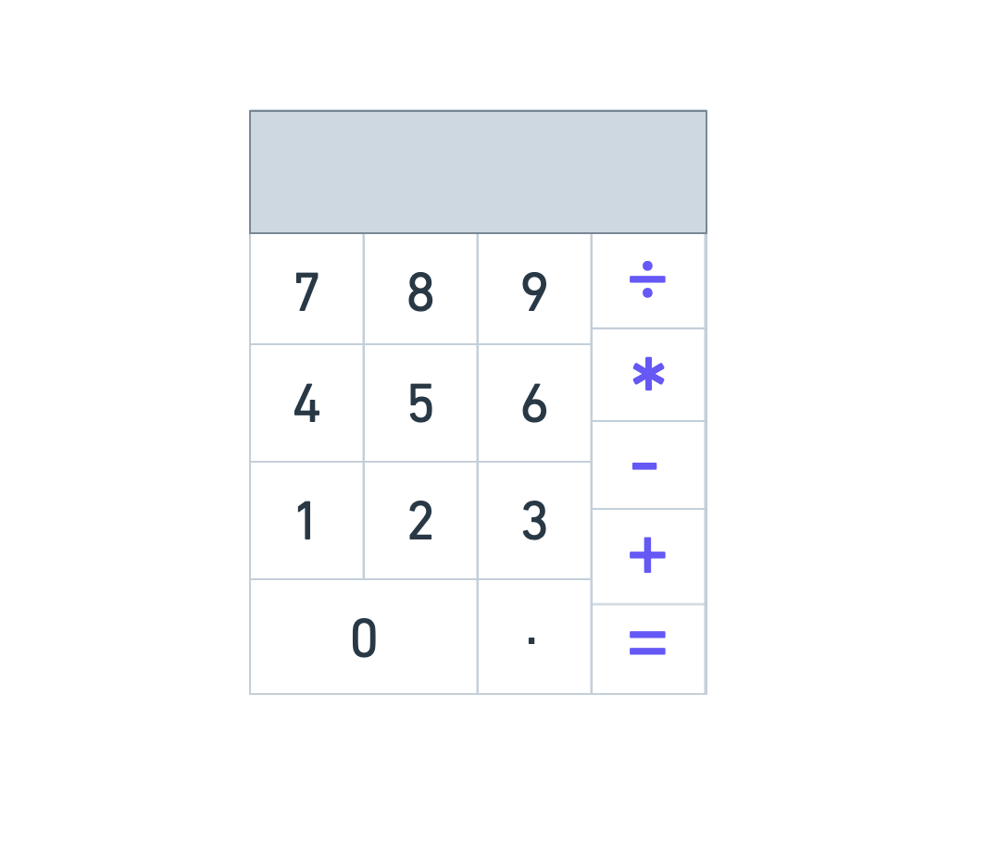

# CalculatorProject
This is my calculator I'm building along with SEV9

# MVP
*Minimum Viable Product*

- Calculator Interface
- Functionality
  -Add
  -Subtract
  -Multiply
  -Divide
  - Clear

  #PMVP
  *Post Minimum Viable Product*

  # Wireframes
  

  # License 